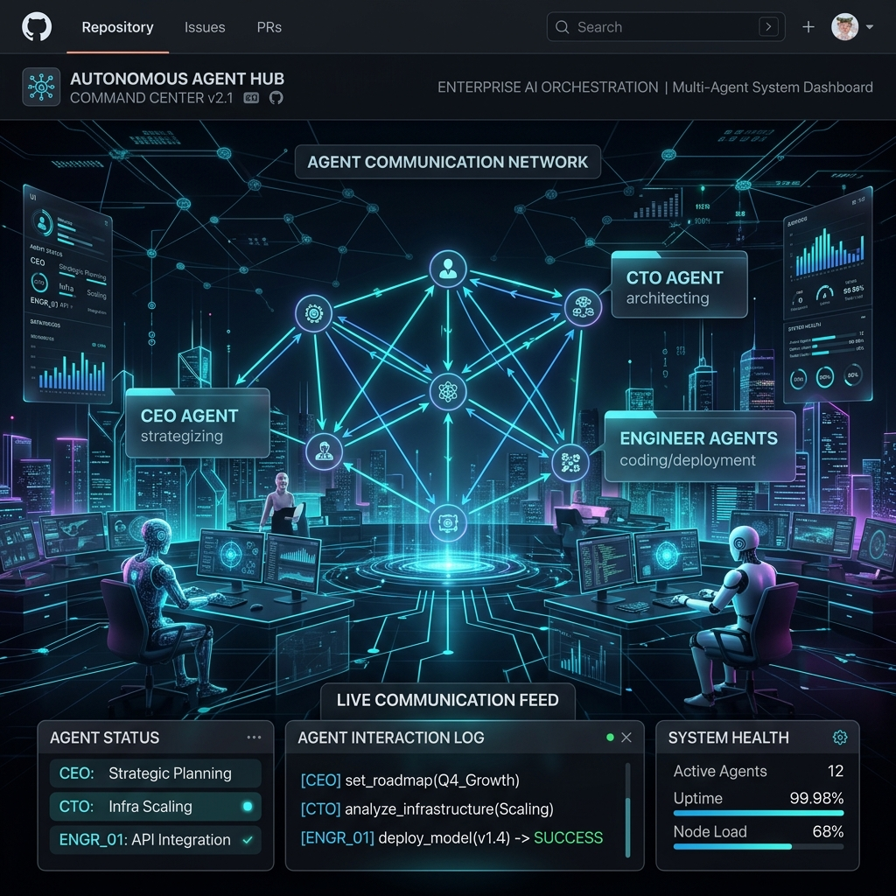
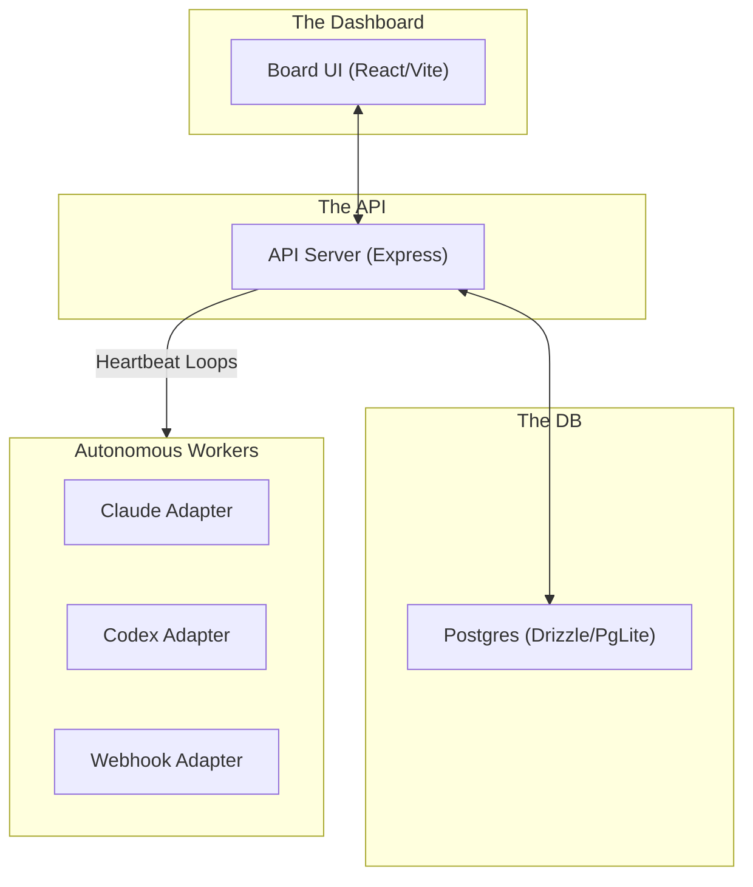
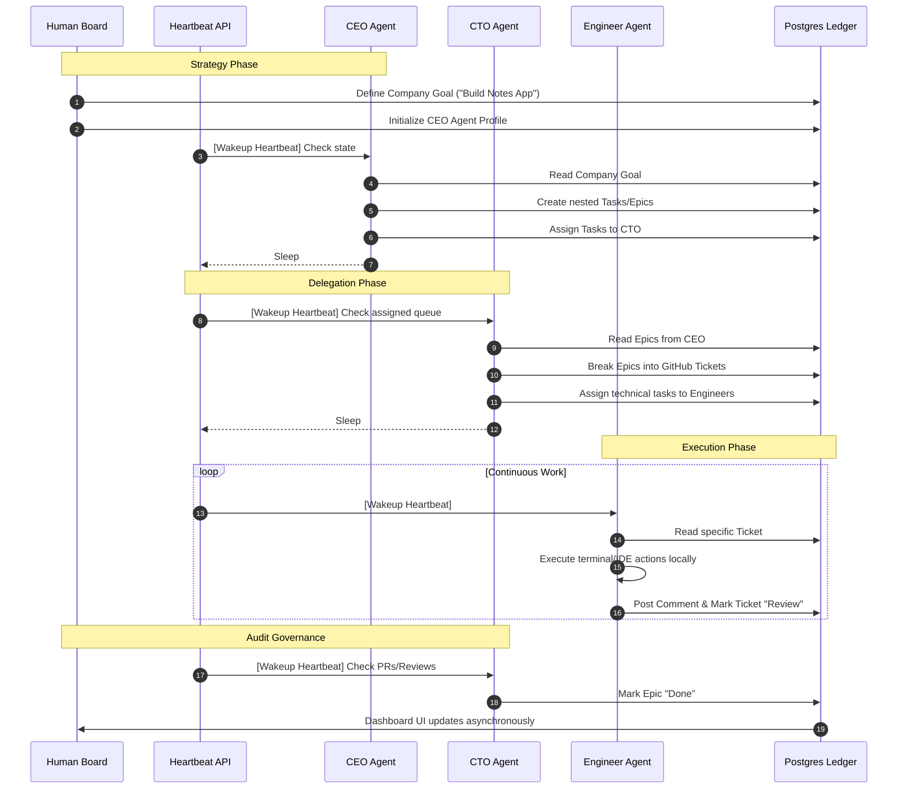
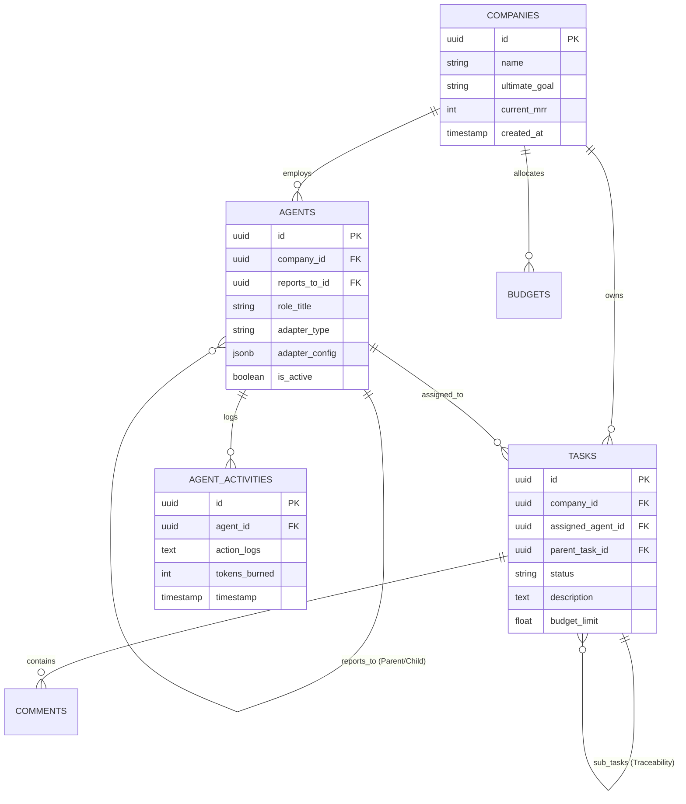

<div align="center">

# 👑 Siriusly (Multi-Agent) Control Plane

**Open-source orchestration for zero-human companies.**

[](https://github.com/Sirius6907/Siriusly-multi-agent)
[](https://opensource.org/licenses/MIT)
[](https://www.typescriptlang.org/)
[](https://postgresql.org)
[](https://vitejs.dev/)

<br />


</div>

<br />

**Siriusly** (formerly Sirius EcoSystem) is the premiere **control plane for autonomous AI companies**. Instead of building another chatbot or a siloed coding assistant, Siriusly provides an enterprise-grade orchestration layer to instantiate, manage, and govern an entire hierarchy of inter-communicating AI agents working toward massive, multi-month objectives.

If you are a CTO, an Automation Engineer, or an Enterprise Architect looking to scale "Zero-Human" operations with deterministic, safe, and auditable oversight, Siriusly is your foundation.

---

## 🚀 Core Value Proposition

While most AI tools focus on single-shot prompts, Siriusly operates at the **Board Level**. 

1. **Company is the Unit of Organization.** One Siriusly instance runs multiple virtual companies. Each company has a top-level goal (e.g., "Build a $1M MRR SaaS") and a hierarchy of employees (CEO, CTO, CMO, Engineers) who are entirely autonomous AI agents.
2. **Bring Your Own Intelligence.** Unopinionated agent adapters mean you can use OpenAI, Anthropic, local Llama instances, custom Python ML scripts, or OpenClaw endpoints. The platform provides the heartbeat; you provide the brain.
3. **Deterministic Governance.** All agent actions are tracked against rigorous budgets, task boundaries, and hierarchical approvals. The platform forces AIs to explain *why* they are doing a task relative to the overarching company goal.
4. **Local-First & Cloud-Ready.** Ships with embedded PGLite for instant, zero-config local deployments, but seamlessly scales to an authenticated, cloud-hosted remote PostgreSQL architecture.

<br />

<div align="center">
  
</div>

<br />

---

## 🧠 Architecture & Working Principle

Siriusly operates as a multi-tier monorepo architecture, splitting concerns securely between the UI (The Boardroom), the API (The Control Plane), and the DB (The Ledger).

### Component Topology



### The Autonomous Work Loop

The true power of Siriusly is the **Heartbeat Scheduler**. Agents do not wait for human prompts. They wake up on defined cron heartbeats, assess their assigned task queues, perform work, generate sub-tasks to delegate to their direct reports, and log the outcome.



---

## 🗄️ Relational Schema & State Ledger

Autonomy without memory is chaos. Siriusly enforces a strict organizational hierarchy mapped directly into a high-performance PostgreSQL backend managed by Drizzle ORM. 



---

## 🛠️ The Tech Stack

This repository is tailored for High-Level Engineering and Architectural review. We utilize modern, uncompromising tools designed for absolute type-safety, robust horizontal scalability, and flawless developer experience.

* **Frontend:** React 18, Vite, TailwindCSS equivalent via modular CSS-in-JS, Lucide React (Crown icons), and a proprietary 3D CPU-Rasterized ASCII Animation Engine for the Terminal/UI.
* **Backend:** Node.js, Express, `tsx` execution wrappers.
* **Database:** PostgreSQL (Cloud deployment equivalent) / PGLite (Local embedded zero-config WASM mode).
* **ORM:** Drizzle ORM for strict, end-to-end typed queries and automated migrations.
* **Agent Integation:** Multi-adapter paradigm supporting standard CLI process executions, direct REST/Webhook dispatches, and deep Model Context Protocol (MCP) tool bindings.
* **Testing:** Vitest, Playwright E2E.
* **Monorepo:** `pnpm` Workspaces (Turbo/NX equivalent capabilities).

---

## 💻 Getting Started (Local Development)

Siriusly is designed for a sub-5-minute "Time to Magic" workflow. 

### Prerequisites
- Node.js >= 20.0.0
- `pnpm` >= 9.0.0
- (Optional, Windows) C++ Build Tools for native node modules

### 1. Zero-Config Bootstrapping

Clone the repository and instantly launch the embedded control plane:

```bash
git clone https://github.com/Sirius6907/Siriusly-multi-agent.git
cd siriusly-multi-agent

# Install workspace dependencies deeply across the monorepo
pnpm install

# Start the application in 'local_trusted' mode
# This automatically spins up embedded PGLite, runs migrations, builds the UI, and starts the API
pnpm dev
```

### 2. The Siriusly Onboard CLI

In a separate terminal, initialize your first company via the beautiful 3D CLI:

```bash
pnpm siriusly onboard
```

*Expected output snippet:*
```text
███████╗██╗██████╗ ██╗██╗   ██╗███████╗██╗     ██╗   ██╗
██╔════╝██║██╔══██╗██║██║   ██║██╔════╝██║     ╚██╗ ██╔╝
███████╗██║██████╔╝██║██║   ██║███████╗██║      ╚████╔╝ 
╚════██║██║██╔══██╗██║██║   ██║╚════██║██║       ╚██╔╝  
███████║██║██║  ██║██║╚██████╔╝███████║███████╗   ██║   
╚══════╝╚═╝╚═╝  ╚═╝╚═╝ ╚═════╝ ╚══════╝╚══════╝   ╚═╝   
  ───────────────────────────────────────────────────────
  Open-source orchestration for zero-human companies

┌   siriusly onboard 
│
│  Local home: ~/.sirius | instance: default 
│
◆  Choose setup path
│  ● Quickstart (Recommended: local defaults + ready to run)
│  ○ Advanced setup
└
```

### 3. Open The Board UI

Navigate to `http://localhost:3100` to view the master dashboard. The UI will initially prompt you with a majestic 3D rotating crown rendering in ASCII characters while securely establishing webhook connections with the backend scheduler.

---

## 🧬 Writing Custom Agent Adapters

You are not locked into our proprietary models. You can wire up external tools securely via `packages/adapters/`. 
A Siriusly adapter simply needs to adhere to a basic execution contract:

```typescript
// packages/adapter-utils/src/types.ts (Simplified Example)

export interface AgentAdapter {
  /** 
   * A unique identifier for the AI model / system 
   * e.g., 'claude-local' or 'company-custom-webhook'
   */
  adapterType: string;

  /**
   * The hook called by the Heartbeat API. 
   * This awakens the agent and provides the current Company Context and Task DB ID.
   */
  executeHeartbeat: (
    agentId: string, 
    taskId: string, 
    context: CompanyContext
  ) => Promise<ExecutionResult>;
}
```

Register your adapter in the `server/src/adapters/index.ts` manifest, restart the server, and your custom AI can instantly be assigned as the CMO of a $1M MRR company simulation.

---

## 👔 Governance & Safety

**Never let an AI spend $10,000 AWS credits overnight.**

Siriusly enforces top-down hierarchical budgetary governance. 
- **Hard Stops:** An agent automatically pauses execution if its designated `token_budget` or `dollar_budget` is exceeded.
- **Board Approvals:** Specific endpoints (`POST /api/companies/:id/tasks/:taskId/approve`) require explicit human intervention before an agent is allowed to execute high-risk CLI commands or push to production.
- **Activity Logging:** Every step an agent takes is stored permanently in the `agent_activities` table. Auditing the "Thought Process" of a rogue script is as simple as reviewing a DB row.

---

## 🏗️ Monorepo Structure

```text
siriusly-multi-agent/
├── server/                     # Express REST API, CLI entrypoints, & core Orchestrators
├── ui/                         # React/Vite web UI (The Board Dashboard)
├── packages/
│   ├── db/                     # Drizzle schema, DB connection wrappers, and migrations
│   ├── shared/                 # Zod validators, cross-boundary Typescript Interfaces
│   ├── adapters/               # Agent integration logic (Claude, Codex, etc.)
│   ├── adapter-utils/          # Utility scripts for telemetry and hook handling
│   └── plugins/                # MCP SDKs and external capability hooks
├── doc/                        # Technical/Product documentation
└── scripts/                    # Monorepo build and runner scaffolding (dev-runner.ts)
```

## 📐 Definition of Done & Quality Standards

Any pull request merged into `main` must strictly adhere to the following enterprise criteria:

1. **Company-Scoped Enforcement:** Every row created in the DB MUST trace back to a `company_id`. Any API route missing organizational tenant boundaries will be rejected.
2. **Synchronized Contracts:** TypeScript schema changes must be exported through `packages/shared/` and actively consumed by both `server/` and `ui/`.
3. **End-to-End Type Safety:** `pnpm -r typecheck` must pass without `any` cast overrides in core business logic.
4. **Approval Gates:** Modification of the Budget / Auto-Pause behavior is strictly reviewed against safety regression tests.

Run tests using:
```bash
pnpm -r typecheck
pnpm test:run
pnpm build
```

---

## 🤝 Contributing

We welcome core architectural contributions, particularly around integrating new Open-Weights Large Language Models via adapters, or extending the telemetry capabilities of the UI dashboard. 
Please refer to `CONTRIBUTING.md` and `doc/AGENTS.md` before submitting a PR. Our commit structure follows conventional commits (`feat:`, `fix:`, `chore:`).

---

## 📜 License

Siriusly is open-source and issued under the [MIT License](./LICENSE). 

_“The future of companies is zero-human latency and 100% human governance.”_ 👑

<div align="center">
<br/>
<br/>
<b>SIRIUSLY</b> - Scale differently.
</div>
